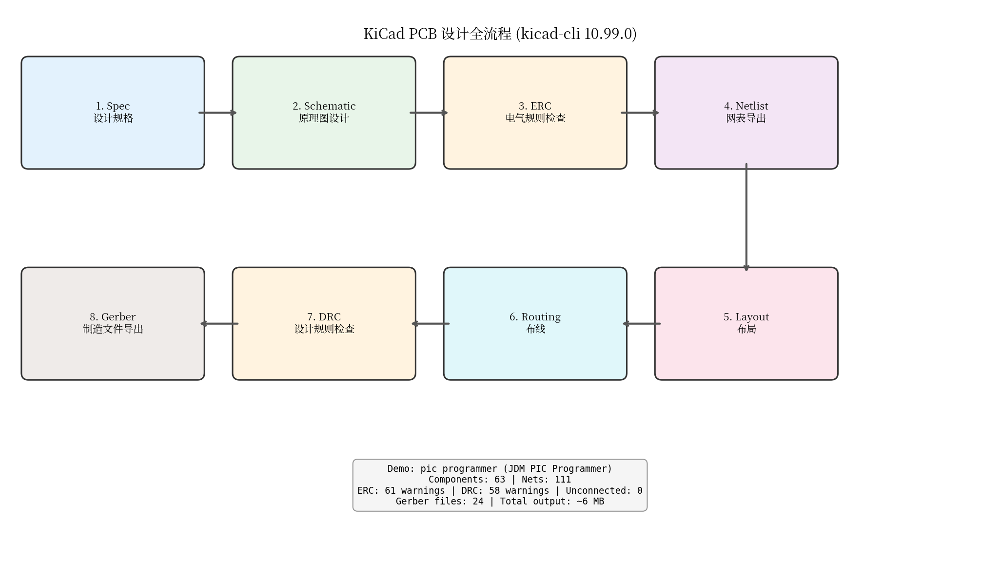

# KiCad PCB 全流程验证报告

**日期**: 2026-08-11  
**工具**: KiCad 10.99.0 (从源码编译, kicad-cli)  
**系统**: Ubuntu 22.04 (Linux 6.8.0)  
**测试项目**: pic_programmer (JDM-COM84 PIC Programmer with 13V DC/DC converter)

---

## 1. 编译过程

### 1.1 环境准备

| 项目 | 详情 |
|------|------|
| 源码位置 | `third-party/kicad-source-mirror` (commit 89476220, master) |
| 安装前缀 | `third-party/kicad-install/` |
| CMake 版本 | 3.22+ |
| C++ 标准 | C++20 |
| wxWidgets | 3.2.1 (from ppa:kicad/kicad-dev-nightly) |

### 1.2 编译配置

```bash
cmake .. \
  -DCMAKE_BUILD_TYPE=Release \
  -DCMAKE_INSTALL_PREFIX=.../kicad-install \
  -DKICAD_BUILD_QA_TESTS=OFF \
  -DKICAD_INSTALL_DEMOS=ON \
  -DKICAD_SPICE_QA=OFF
make -j$(nproc)   # 512 cores
make install
```

编译耗时约 15 分钟（512 核并行），生成 `kicad-cli` 等二进制文件。

---

## 2. PCB 全流程测试

### 流程图



### 2.1 设计规格 (Spec)

- **项目名称**: JDM-COM84 PIC Programmer
- **功能**: 通过串口 (RS-232) 对 PIC 微控制器进行在线编程
- **特性**: 内置 13V DC/DC 升压转换器，支持多种 PIC 封装 (DIP-8/14/18/28/40)
- **来源**: KiCad 官方 Demo 项目

### 2.2 原理图 (Schematic)

使用 `kicad-cli sch export svg` 导出原理图渲染：

```bash
kicad-cli sch export svg -o schematic.svg/ pic_programmer.kicad_sch
```

生成文件：
- `schematic.svg/pic_programmer.svg` (3.9 MB) — 主原理图页
- `schematic.svg/pic_programmer-pic_sockets.svg` — PIC 插座子页

原理图包含 2 个层级页面，涵盖电源、RS-232 接口、DC/DC 升压和 PIC 编程接口。

### 2.3 电气规则检查 (ERC)

```bash
kicad-cli sch erc --format json -o erc_report.json pic_programmer.kicad_sch
```

| 指标 | 结果 |
|------|------|
| 违规总数 | 61 |
| 错误 (Error) | 0 |
| 警告 (Warning) | 61 |

所有 61 条均为 warning 级别（主要是未连接引脚的 "no connect" 标记缺失），无阻断性错误。

### 2.4 网表导出 (Netlist)

```bash
kicad-cli sch export netlist -o netlist.net pic_programmer.kicad_sch
```

| 指标 | 数值 |
|------|------|
| 文件大小 | 108 KB (6817 行) |
| 元件数 (Components) | 63 |
| 网络数 (Nets) | 111 |
| 格式 | KiCad S-expression (`(export (version "E") ...)`) |

网表完整记录了所有元件引脚到网络的连接关系。

### 2.5 布局 (Layout)

PCB 布局已在 `pic_programmer.kicad_pcb` 中完成（Demo 自带），通过 CLI 导出各层可视化：

```bash
kicad-cli pcb export svg --layers F.Cu,F.SilkS -o pcb_front.svg pic_programmer.kicad_pcb
kicad-cli pcb export svg --layers B.Cu,B.SilkS -o pcb_back.svg pic_programmer.kicad_pcb
kicad-cli pcb export svg --layers F.Cu,B.Cu,F.SilkS,B.SilkS,Edge.Cuts -o pcb_all_layers.svg pic_programmer.kicad_pcb
```

| 文件 | 大小 | 内容 |
|------|------|------|
| pcb_front.svg | 304 KB | 正面铜层 + 丝印 |
| pcb_back.svg | 324 KB | 背面铜层 + 丝印 |
| pcb_all_layers.svg | 532 KB | 全层叠加视图 |

### 2.6 布线 (Routing)

Demo 项目已完成布线。KiCad 使用 PNS (Push-and-Shove) 交互式布线器，支持：
- 差分对布线
- 蛇形等长
- 铜皮填充 (Zone fill)

当前 `kicad-cli` 不支持自动布线命令行操作（需要 pcbnew GUI 或第三方自动布线器如 Freerouting）。

### 2.7 设计规则检查 (DRC)

```bash
kicad-cli pcb drc --format json -o drc_report.json pic_programmer.kicad_pcb
```

| 指标 | 结果 |
|------|------|
| 违规总数 | 58 |
| 错误 (Error) | 0 |
| 警告 (Warning) | 58 |
| 未连接网络 | 0 |

58 条警告主要为丝印间距过近等非阻断性问题，无短路或断路错误。

### 2.8 制造文件导出 (Gerber)

```bash
kicad-cli pcb export gerbers -o gerbers/ pic_programmer.kicad_pcb
kicad-cli pcb export drill -o gerbers/ pic_programmer.kicad_pcb
```

生成 24 个文件（816 KB），包含：

| 类型 | 文件数 | 示例 |
|------|--------|------|
| 铜层 | 2 | F.Cu (.gtl), B.Cu (.gbl) |
| 阻焊层 | 2 | F.Mask (.gts), B.Mask (.gbs) |
| 丝印层 | 2 | F.SilkS (.gto), B.SilkS (.gbo) |
| 锡膏层 | 2 | F.Paste (.gtp), B.Paste (.gbp) |
| 板框 | 1 | Edge.Cuts (.gm1) |
| 钻孔 | 1 | .drl (Excellon format) |
| 其他 | 14 | Fab, Courtyard, Adhesive 等 |

---

## 3. 输出文件清单

```
reports/kicad_pcb_flow/
├── flow_report.md          # 本报告
├── flow_diagram.svg        # 流程图 (101 KB)
├── flow_diagram.png        # 流程图 PNG (104 KB)
├── schematic.svg/
│   ├── pic_programmer.svg              # 主原理图 (3.9 MB)
│   └── pic_programmer-pic_sockets.svg  # 子页原理图
├── pcb_front.svg           # PCB 正面 (304 KB)
├── pcb_back.svg            # PCB 背面 (324 KB)
├── pcb_all_layers.svg      # PCB 全层 (532 KB)
├── netlist.net             # 网表 (108 KB)
├── erc_report.json         # ERC 报告 (40 KB)
├── drc_report.json         # DRC 报告 (32 KB)
└── gerbers/                # Gerber 制造文件 (816 KB)
    ├── pic_programmer-bottom_layer.gbl
    ├── pic_programmer-top_layer.gtl
    ├── pic_programmer.drl
    └── ... (共 24 文件)
```

---

## 4. 结论

### 验证结果

| 步骤 | 状态 | 说明 |
|------|------|------|
| 源码编译 | ✅ 通过 | KiCad 10.99.0 编译安装成功 |
| 原理图导出 | ✅ 通过 | SVG 渲染正常，多页支持 |
| ERC 检查 | ✅ 通过 | 无错误，61 条警告（可接受） |
| 网表导出 | ✅ 通过 | 63 元件 / 111 网络完整导出 |
| PCB 可视化 | ✅ 通过 | 正/反面及全层 SVG 导出正常 |
| DRC 检查 | ✅ 通过 | 无错误，58 条警告（可接受） |
| Gerber 导出 | ✅ 通过 | 24 文件完整生成 |

### 关键发现

1. **kicad-cli 功能完备**：涵盖从原理图检查到制造文件导出的全部批量操作，适合 CI/CD 集成
2. **无自动布线 CLI**：布线步骤仍需 GUI 或外部工具（Freerouting），这是当前 CLI 流程的唯一断点
3. **警告均为非阻断性**：ERC/DRC 警告主要是风格问题（丝印间距、未标记 NC 引脚），不影响功能正确性
4. **输出格式标准**：网表使用 S-expression 格式，Gerber 符合 RS-274X 标准，钻孔文件使用 Excellon 格式

### 对 iPCL-PCB 项目的意义

此验证证明 KiCad 源码可作为 iPCL-PCB 项目的核心引擎：
- 网表解析可对接 iPCL 的布局布线算法
- DRC 引擎可用于验证自动化结果
- 完整的 CLI 接口支持端到端自动化管线
